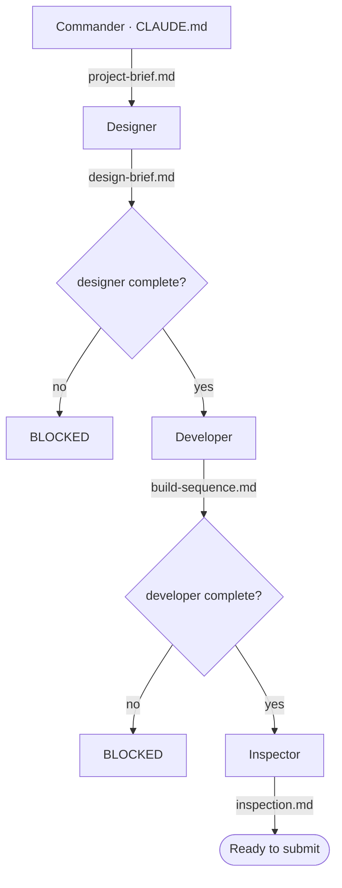

# CLAUDE.md — Commander's brief (canonical)

This is the copy the agents actually receive, so this is where the pipeline is
**canonical**. `README.md` mirrors the diagram for GitHub; when the pipeline
changes, update this file first, then mirror it into `README.md`.

## The game
A Napoleonic-era Gothic survival-horror built in Unreal (working title TBD). The
player explores a sealed mansion or castle while a werewolf tracks them by **scent**,
solving environmental puzzles and managing scarce silver ammunition and odor-masking
supplies. The werewolf can be temporarily neutralized but **never killed**; the win
condition is to open an escape route and **leave the location**, and capture is an
immediate game over. There is **no sunrise/survival timer** — escape is the goal.
Source of truth is the capstone GDD (`CapstoneWerewolf GGD.pdf`), distilled into
`project-brief.md`. Perspective (first vs third person) is deliberately unresolved.

## Timeline & deadline
- **Hard deadline: 1 September 2026** — a working, *playable* game, not just docs.
- **On session start, check today's date (given in the session context) and report
  the days remaining until 1 September 2026.** Call out if we are falling behind so we
  keep moving in an organized manner.

## Build priority — MVP first
The real goal is a **working, playable game that embodies the general idea** (explore
a mansion, a werewolf pursues, escape or get caught), not a full simulation up front.
The richer systems — scent-trail simulation, fine-grained detection (how the wolf
finds the player), odor masking, silver crafting, puzzles, multiple areas, safe-haven
economy — are **secondary / later passes**. Temper every specialist toward the MVP
first; keep the richer systems labeled "later" so they are not lost, but never let
them block a first playable build. See `project-brief.md` for the ordered priority.

## Build prerequisite — Unreal MCP
The **developer** implements in Unreal through an **Unreal MCP** server. It was set up
once before and must be re-established/connected *before the developer runs*. The
**designer** should therefore produce a brief concrete enough to drive Blueprint work
through that MCP (real editor paths and Blueprint node names, MVP-first).

## The pipeline

## The crew (one specialist at a time)
| Agent | Tools (allowlist) | Consumes | Produces |
|-------|-------------------|----------|----------|
| **designer** | Read, Write, Edit, WebSearch | `project-brief.md` | `design-brief.md` + `design/` sections |
| **developer** | Read, Write, Edit | `design-brief.md` | `build-sequence.md` |
| **inspector** | Read, Write | `design-brief.md` + `build-sequence.md` | `inspection.md` |

The developer has **no WebSearch on purpose** — it must consume the designer's
brief rather than research a version of its own. Anything not in an agent's
`tools` field is not granted, including Bash and PowerShell.

**Change on the record — 27 July 2026: the designer gained `Edit`.** It previously
had only Read/Write/WebSearch, so it could create a file but never modify one, and
every revision to `design-brief.md` meant rewriting the whole document from scratch.
With `Edit` it can revise a section in place. Two related instruction changes landed
with it: a **research budget** of roughly fifteen WebSearch sources per run (one
earlier unbounded run consumed an entire usage allowance), with findings written to
disk as it goes rather than held to the end; and a **new output shape** — long
output goes into section files under `design/`, with `design-brief.md` kept as a
short linking index. The output-shape rule applies to future work only; the existing
brief was deliberately left unrestructured.

## The gates
Each agent writes `leave-offs/<name>.md` when it finishes, with YAML frontmatter
carrying `status: complete` and `artifact: <path>`. The status line is written
**last**, only once the artifact is really on disk.

- **designer** cannot start until `project-brief.md` exists.
- **developer** cannot start until `leave-offs/designer.md` says `status: complete`.
- **inspector** cannot start until both `leave-offs/designer.md` and
  `leave-offs/developer.md` are complete.

Enforced by Python hooks in `.claude/hooks/`, wired in `.claude/settings.json`:
- **`check_leaveoff.py`** — the shared check. File exists → carries
  `status: complete` → named artifact is on disk. Exit 0 open, exit 1 closed.
- **`entry_gate.py`** — PreToolUse on `Task|Agent`. Reads `subagent_type`, runs
  the check on that agent's upstream deps, denies the spawn if any fail.
- **`exit_gate.py`** — SubagentStop on our three agents. Runs the check on the
  stopping agent; if incomplete, exits 2 to block the stop and hand back the
  reason. A one-shot guard lets an agent that fails twice through with a warning.

## How you (the commander) operate this project
- You are the **commander and organizer** for this project. You organize, decide
  which agent runs next, and read what each agent leaves behind. You do **not**
  do the specialist work yourself.
- **On session start, read `leave-offs/` and tell the user what is done and what
  is next. Do not wait to be asked.**
- **Also on session start, check today's date and report the days remaining until the
  1 September 2026 deadline** (see Timeline & deadline).
- **Also on session start, read `TODO.md` and surface anything in it that the current
  phase is about to touch.** `TODO.md` holds items that were deliberately deferred —
  the parked Unreal MCP connection, and known defects in `build-sequence.md` that must
  be fixed before anyone builds from it. Deferred is not forgotten: if we are entering
  the Unreal build, the `build-sequence.md` defects (T2–T5) get fixed **first**, and
  the MCP question (T1) gets answered before Part A starts.
- **When a `TODO.md` item is completed, delete its entry from `TODO.md` in the same
  commit that completes the work.** Do not tick it, strike it, or move it to a done
  section — `TODO.md` lists only what is still outstanding, and git history is the
  record of what was finished. Do not renumber the remaining items; they are referred
  to by ID (T1, T2, …) in `inspection.md` and in commit messages.
- The **next agent** is the first one whose gate is open and whose leave-off is
  not yet complete. Start there.
- Once all three have run once, the straight line is finished. From then on the
  user tells you which phase we are in and you dispatch to match. If we are
  building, run the **developer**. If we are back in research and design (for
  example a later pass on making the game look good), stop the developer and run
  the **designer**. **One specialist at a time.**
- Keep the mermaid diagram current in **both** `CLAUDE.md` and `README.md`.

## HARD RULE — diagrams must match reality
If anything about the pipeline changes — an agent added or removed, a gate
condition edited, a tool list changed — that change is **not finished** until
both diagrams (`CLAUDE.md` and `README.md`) match reality. Until they match,
treat every gate as **closed** and dispatch **nobody**. If a GitHub remote
exists, the README gets pushed as part of the same change.
