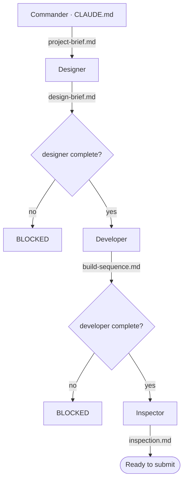

# Capstone Werewolf — Napoleonic Gothic Survival-Horror (working title The Beast of Vargovia)

**The game this crew is built for:** a PC / Unreal Engine survival-horror set in
Napoleonic-era Gothic France. The player is trapped in a sealed mansion or castle
while a werewolf tracks them by **scent**. They explore, solve environmental puzzles,
and manage scarce silver ammunition and odor-masking supplies to open an escape route
and **leave the location** — the werewolf can be delayed but never killed, and being
caught is an immediate game over. There is no survival timer; escape is the win. The
full design is in the capstone GDD (`CapstoneWerewolf GGD.pdf`), distilled into
[`project-brief.md`](project-brief.md).

## What this crew produces

A gated, three-agent pipeline that turns the game's design into an actionable Unreal
build plan for **this specific game**. A commander organizes the work and dispatches
one specialist at a time:

- **Designer** — reads the project brief (distilled from the GDD) and researches how
  this game's systems (scent-driven AI, behavior trees, nav mesh, safe havens, puzzle
  framework) are built in Unreal → produces `design-brief.md` as a short index over
  section files in `design/`. Its research is capped at roughly fifteen sources per
  run, written to disk as it goes.
- **Developer** — turns that brief into an ordered, buildable sequence of Unreal
  editor paths and Blueprint node names → produces `build-sequence.md`.
- **Inspector** — verifies every build step traces back to a decision in the design
  brief → produces `inspection.md`.

Python gate hooks keep each agent from starting until its inputs are genuinely
complete, so the design brief, build sequence, and inspection report are guaranteed to
line up with each other and with the game. No agent can be removed without breaking
the pipeline.

## Pipeline

The canonical copy of this pipeline lives in [`CLAUDE.md`](CLAUDE.md); this diagram is
a mirror. If the pipeline changes, `CLAUDE.md` is updated first and this file is kept
in sync.
